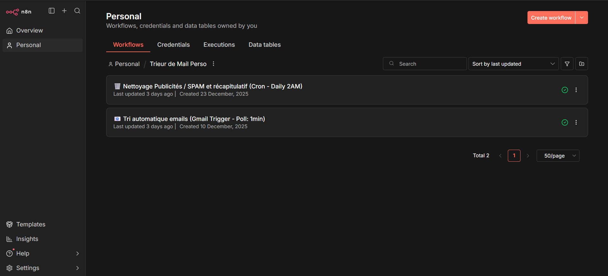
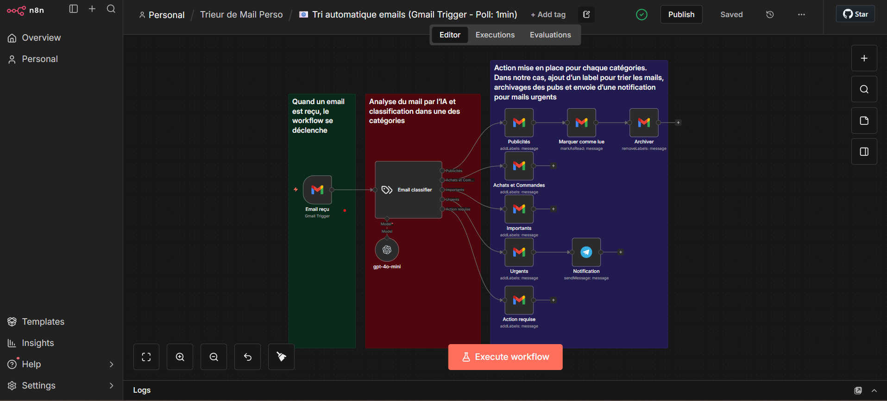
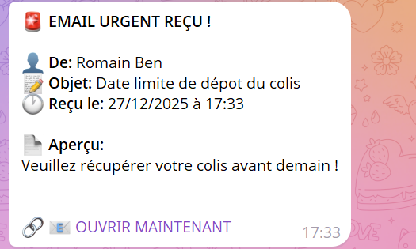
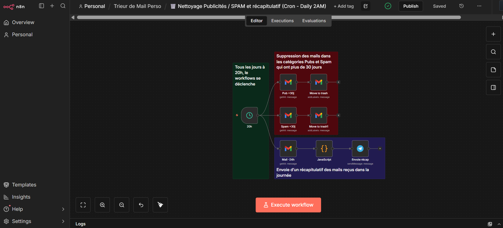
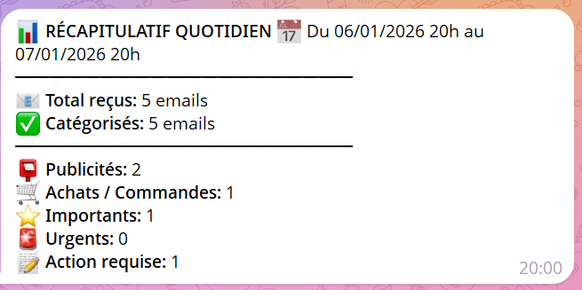

# 📬 Automatisation intelligente de boîte Gmail avec n8n

## 📌 Présentation générale

Ce projet est un **système complet d’automatisation de boîte Gmail**, basé sur l’intelligence artificielle, dont l’objectif est de **gagner du temps**, **éviter les erreurs humaines** et **maintenir une boîte mail propre et organisée sans intervention manuelle**.

Développé avec **n8n**, hébergé sur un **VPS**, et s’appuyant sur **l’API OpenAI**, le système analyse les emails entrants en temps réel, les classe automatiquement, déclenche des notifications pour les messages urgents et effectue des tâches de nettoyage planifiées.

⏱️ Résultat : **20 à 30 minutes économisées par jour**, **aucun email important manqué**, gestion entièrement automatisée de la boîte mail.

---

## 🎯 Contexte et motivation

La gestion quotidienne des emails pose plusieurs problèmes :
- Accumulation rapide de spams et publicités  
- Difficulté à identifier les messages réellement prioritaires  
- Temps perdu à trier manuellement la boîte de réception  

Les filtres classiques proposés par Gmail sont **basés sur des règles statiques** et montrent rapidement leurs limites.  
L’objectif de ce projet était donc de concevoir un **système intelligent, adaptatif et évolutif**, capable de comprendre le contenu réel des emails et d’agir de manière autonome.

---

## 🧠 Architecture globale

Le projet repose sur **deux workflows principaux**, conçus pour limiter la complexité tout en conservant une logique claire :

1. **Workflow temps réel**  
   → Classification automatique des emails et notification des messages urgents  

2. **Workflow planifié**  
   → Nettoyage automatique de la boîte mail et envoi du récapitulatif quotidien  

---

## 🔧 Optimisation et rationalisation des workflows

Les premières versions du projet utilisaient plusieurs workflows indépendants.  
Une phase d’optimisation a permis de **regrouper les fonctionnalités ayant des logiques communes**, afin de :

- Réduire le nombre de workflows  
- Diminuer les déclencheurs inutiles  
- Améliorer la lisibilité et la maintenabilité  

Cette approche permet une architecture plus compacte, proche des pratiques utilisées en environnement professionnel.

---

## 🗂️ Workflow temps réel : tri automatique & notifications urgentes

### 🔹 Objectif
Classer automatiquement chaque email entrant et garantir qu’**aucun message critique ne soit manqué**.

### 🔹 Catégories gérées
- **Publicités**
- **Achats et commandes**
- **Importants**
- **Actions requises**
- **Urgents**

### 🔹 Fonctionnement
1. Détection d’un nouvel email via Gmail  
2. Analyse du sujet et du contenu par **OpenAI (GPT-4o Mini)**  
3. Retour d’une classification structurée  
4. Routage conditionnel selon la catégorie :
   - Archivage automatique des publicités  
   - Notification Telegram instantanée pour les emails urgents  

### 🔹 Bénéfices
- Traitement en temps réel  
- Réduction du risque d’oubli  
- Logique centralisée et efficace  

---

## 🧹 Workflow planifié : nettoyage automatique & récapitulatif quotidien

### 🔹 Objectif
Assurer une **hygiène durable de la boîte mail** et fournir une vision synthétique de l’activité.

### 🔹 Fonctionnalités
- Archivage et suppression des spams et publicités de plus de **30 jours** (hebdomadaire)  
- Envoi d’un **récapitulatif quotidien à 20h** indiquant le nombre d’emails reçus par catégorie  

### 🔹 Bénéfices
- Boîte de réception toujours organisée  
- Moins de charge cognitive  
- Exécution planifiée et optimisée dans un seul workflow  

---

## ⚙️ Technologies utilisées

- **n8n** (auto-hébergé sur VPS)  
- **API OpenAI – GPT-4o Mini**  
- **Gmail API**  
- **Telegram Bot API**  
- **VPS (environnement Docker)**  

---

## 🚧 Problèmes rencontrés & solutions

### 1️⃣ Limites et quotas de l’API Gmail  
➡️ Réduction du nombre d’appels et mutualisation des traitements.

### 2️⃣ Précision de la catégorisation IA  
➡️ Ajustement du prompt et structuration stricte des réponses.

### 3️⃣ Complexité des workflows  
➡️ Regroupement des fonctionnalités et logique conditionnelle optimisée.

---

## 💰 Coût du système

- API OpenAI : **~0,50 € / mois**  
- Hébergement VPS : infrastructure existante  
- Coût total : **très faible au regard du gain de productivité**

---

## 📈 Résultats et impact

- ⏱️ **20 à 30 minutes économisées par jour**  
- 📥 **Boîte mail toujours propre et organisée**  
- 🚨 **Aucun email important manqué**  
- 🔁 Système totalement autonome  

---

## 🔮 Améliorations possibles

- **Détecteur de spam dédié**, combinant IA et heuristiques classiques  
- **Amélioration de la précision de la catégorisation**, avec apprentissage progressif à partir des corrections utilisateur  
- **Génération automatique de brouillons de réponse par l’IA** pour les emails nécessitant une action  

---

Projet développé dans une démarche personnelle, mettant en œuvre :
- Automatisation de processus  
- Intégration d’API  
- Optimisation de workflows  
- Utilisation raisonnée de l’IA en production

## 👨‍💻 Auteur

Projet réalisé par **Romain Ben**  
🔗 LinkedIn : [romainben](https://www.linkedin.com/in/romainben/)
